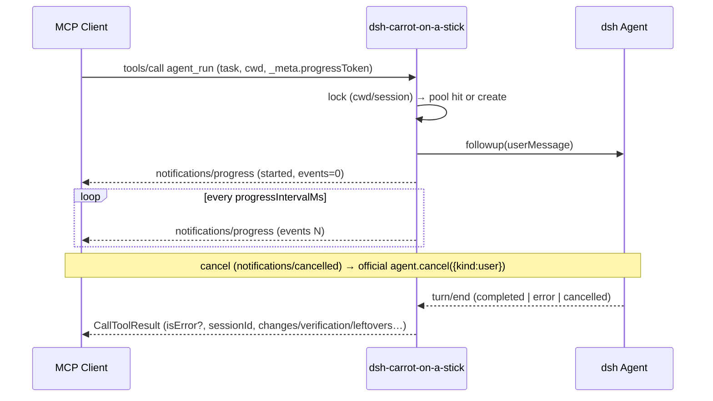

# DSH Carrot on a Stick

> Operate [DeepSeek Harness](https://github.com/deepseek-ai/deepseek-harness) (dsh) over MCP: run an MCP server inside the dsh process and expose session execution, task queues, and workspace management to any MCP client.

[](https://www.npmjs.com/package/dsh-carrot-on-a-stick)
[](./LICENSE)

> 📖 English (this page) · [中文](./README.zh-CN.md)

## What it does

dsh ships a complete agent runtime — model routing, tool sandbox, presets, persistent sessions — but it is a Cordis application that external programs cannot call directly. dsh-carrot-on-a-stick turns it inside out: the plugin starts an MCP server (StreamableHTTP) inside the dsh process and bridges the live harness through `ctx.agents` / `ctx.agentPresets` / `ctx.tools`.

**Your MCP client is the commander; dsh is the executor.** Works with Claude Code, Codex CLI, Cursor, another dsh instance (via the official `dsh-mcp-client`), or any automation script.

```
MCP client (Claude Code / Codex / another dsh / …)
   │  agent_run / task_* / session_* / model_list / select_model (HTTP + Bearer)
   ▼
dsh-carrot-on-a-stick (MCP server, 127.0.0.1:8090)
   │  ctx.agents.create → mount preset
   ▼
dsh agent — full toolset: bash, fs, todo, web…
```

`agent_run` lifecycle (progress + cancellation are spec-native):



## Tools

| Tool | Purpose |
|---|---|
| `dsh_get_started` | **call this first if you are new to dsh** — concept glossary, workflow recipes, and an error→alternative-path cheat sheet (static markdown; also summarized in the server's `instructions` at initialize) |
| `echo` | connectivity check |
| `dsh_list_tools` | list the host-global tool registry (name + description; model tools are preset-scoped, usually empty) |
| `dsh_status` | plugin status snapshot: version / listening / uptime / config summary / queue counters / resident agents / connected clients (same data as the web panel) |
| `workspace_list` | list registered workspaces (id / path / member sessions) |
| `model_list` | list currently routable providers, model ids, reasoning efforts, and the default selection (look here before picking a model) |
| `agent_run` | run a task synchronously, structured result; `sessionId` continues a session; `provider`/`model`/`reasoningEffort` pick this run's model; `preset` picks the persona for a **new** session; `detail` controls result size; cancellable via the MCP `notifications/cancelled` (the host agent's official `cancel` is invoked); reports `notifications/progress` heartbeats when the caller passes `_meta.progressToken` |
| `agent_steer` | real-time intervention on a running agent — `mode=steer` (default) delivers steering consumed at the next step boundary of the current turn; `mode=inject` queues model-facing context without waking the driver; target is `sessionId` (pooled/live) or `taskId` (a running queue task); steering an idle session is refused (use `agent_run`) |
| `task_inbox` | push a structured task (task + context + cwd + model + preset) into the async queue, returns `taskId` |
| `task_result` | fetch a queued task's result; `detail=status` is a lightweight poll that never re-injects the payload |
| `task_list` | list queued/running/finished tasks (queue observability) |
| `task_cancel` | cancel a queued or running task (a running one is cancelled through the host's official `agent.cancel`) |
| `session_list` | list known sessions (live + persisted, newest first) to pick `sessionId`s for continuation |
| `session_history` | read a live session's transcript summary (user/assistant/tool turns, newest first, truncated) |
| `select_model` | switch the model of an **existing session** (official `sessionController.selectModel` path) |
| `attach_session` | attach a session to the workspace of its cwd |
| `rename_session` | rename an existing session |

## Model selection

Priority: **per-call arguments > plugin config (`provider`+`model`) > host default selection** (`ctx.agentDefaultModel.currentSelection()`, the same source the Web UI uses when creating a session). Supplying only one half completes it from the lower-priority source; if the pair still cannot be resolved the call fails loudly instead of running with an empty model (an empty model leaves the persona's `{{model}}` variable unset and fails the whole turn at assembly time).

**`reasoningEffort` follows the model's source**: call argument > plugin config > the host default selection's own effort. But when the caller or the plugin config **pins provider+model explicitly**, the host's effort (chosen for some other model) is not inherited — the host rejects unsupported explicit efforts instead of clamping or aliasing, so inheriting one would break a deployment that used to work.

Three ways to change models:

| Goal | How |
|---|---|
| Run this one task on another model | pass `provider`+`model` (plus optional `reasoningEffort`) to `agent_run` / `task_inbox` |
| Switch models mid-conversation, keeping history | `select_model` (official `sessionController.selectModel`: validated, writes a durable notice, takes effect on the next step; history is preserved) |
| Pin one model for the whole deployment | set `provider`+`model` in the plugin config and `allowModelOverride: false` to refuse caller overrides |

Two source semantics worth knowing:

- **The resident session pool is keyed by `cwd + model triple + preset`.** Task 1 on model A and task 2 on model B in the same directory are two separate sessions (no shared context), so which model a session uses is always predictable; to switch models inside one session, use `select_model`.
- Results now carry `model: {provider, model, reasoningEffort?}` (and `preset` when known) so the caller never has to guess who answered.

**Per-call preset (persona)** — `agent_run` / `task_inbox` accept a `preset` argument (an id from the `agentPresets` roster) for **newly created sessions**; the pool keys by it, so a "worker" agent and a "reviewer" agent can coexist in the same directory. Taking over an existing session (`sessionId`) keeps that session's original preset — to change persona, open a new session (same semantics as model). The deployment can lock it with `allowPresetOverride: false`; unknown preset ids are refused with the available list.

`model_list`'s `source` names the catalog's origin: `sessionController` = the official view (same data source as the Web UI's model selector; includes `default`, `routableProviders`, per-provider load failures, and reasoning efforts); `llm` = fallback (`llm.listProviders()` + per-provider `listModels()`, for deployments without `sessionController`, e.g. headless, and without reasoning metadata). It also reports the plugin's own model config and `allowModelOverride`, so a caller can see at a glance whether it may choose.

**Result detail levels (token budget)** — the whole point of this plugin is saving the caller's (operator's) context: execution details stay inside dsh, and read-back is projected by `detail`:

- `summary` (default, a few hundred tokens): the `changes/verification/leftovers` three-line summary + the answer tail (the summary JSON sits at the end) + tool-name list + `error`
- `normal` (~2k tokens): the above + truncated tool-call arguments and results
- `full` (up to tens of thousands of tokens, for debugging): the full text
- `task_result` also has a `status` level: polling returns only `{taskId, status, error?}` — fetch the summary once after completion instead of re-injecting the payload on every poll

When continuing the same `sessionId`, the executor already remembers prior turns — send only the **delta** in `context`.

Every result is structured: `sessionId / model / preset / durationMs / usage? / assistantText / toolCalls / toolResults / changes / verification / leftovers` — ready to be persisted by the caller. `durationMs` is the wall-clock turn duration; `usage` is opportunistically aggregated from the host's `TokenUsage` when present.

Sessions are reused per `cwd + model + preset` (LRU, default 8) to avoid reloading project context on every call.

## Typical workflows

**1. One-off task, synchronous** — get a structured summary back:

```json
{ "name": "agent_run", "arguments": { "task": "fix the failing test in src/auth", "cwd": "/workspace/app" } }
```

Continue it later with `"sessionId": "<from the result>"` — send only the delta in `context`.

**2. Fire-and-forget queue** — submit, poll cheaply, cancel if needed:

```json
{ "name": "task_inbox", "arguments": { "task": "…", "cwd": "/workspace/app", "provider": "deepseek-official", "model": "…" } }
→ { "taskId": "…" }
{ "name": "task_result", "arguments": { "taskId": "…", "detail": "status" } }   // poll: no payload re-injection
{ "name": "task_cancel", "arguments": { "taskId": "…" } }                        // optional
{ "name": "task_result", "arguments": { "taskId": "…" } }                        // fetch the summary once done
```

`task_list` shows everything queued/running/finished at a glance.

**3. Discover and steer sessions** — find the right session, check its model, read what happened:

```json
{ "name": "session_list", "arguments": { "limit": 10 } }                // sessionId / title / cwd / model
{ "name": "session_history", "arguments": { "sessionId": "…" } }        // recent turns, truncated
{ "name": "select_model", "arguments": { "sessionId": "…", "provider": "…", "model": "…" } }
```

**4. Long synchronous runs** — `agent_run` supports MCP-native progress and cancellation: clients
that pass `_meta.progressToken` receive `notifications/progress` heartbeats (`agent running: turn N,
last tool X, M new events`), and any client can cancel via the standard `notifications/cancelled`
(both wired to the host agent's official `cancel`). No custom polling protocol required.

**5. Real-time steering** — redirect a running agent instead of cancelling and re-running:

```json
{ "name": "agent_steer", "arguments": { "sessionId": "…", "message": "stop refactoring; just fix the test" } }
{ "name": "agent_steer", "arguments": { "taskId": "…", "message": "the API changed, see docs/v2.md", "mode": "inject" } }
```

`steer` is consumed at the next step boundary of the current turn (the turn completes normally with
a full structured result); `inject` adds model-facing context without waking the driver. Steering an
idle session is refused with a pointer to `agent_run`.

**6. Browse without spending tokens** — MCP resources mirror the read tools
(`dsh://status`, `dsh://queue`, `dsh://sessions`, `dsh://sessions/{sessionId}/history`):
`resources/list` + `resources/read` for clients that support them, same whitelist boundaries.

## Install & run

Requires the dsh host to run on **Node.js >= 18** (the plugin declares `engines` accordingly).

The plugin must be installed into a dsh **profile directory** (the loader resolves plugin names from there; `--patch` alone from a repo checkout will not find the local package — see finding 1 in the [E2E report](./docs/e2e-0.1.5-rc.2.zh.md)):

```bash
git clone https://github.com/Leawind/dsh-carrot-on-a-stick.git
cd dsh-carrot-on-a-stick
npm install && npm run build
npm pack                                        # produces dsh-carrot-on-a-stick-<ver>.tgz

dsh plugin --profile web add "<path_to_tgz>" -w

export DEEPSEEK_API_KEY=...                     # model credentials (or use what ~/.dsh already stores)
dsh --profile <profile> --patch ./cordis.yml --no-open --port 3081
```

The MCP server listens on `127.0.0.1:8090` (StreamableHTTP). Point any MCP client at `http://127.0.0.1:8090/mcp`.

### Client configuration

Generic (any streamable-http capable MCP client):

```json
{
  "mcpServers": {
    "dsh": {
      "url": "http://127.0.0.1:8090/mcp",
      "headers": { "Authorization": "Bearer <your-secret-token>" }
    }
  }
}
```

Let **another dsh** operate this one (add to the peer profile's `cordis.patch.yml`, using the official `dsh-mcp-client`):

```yaml
- id: dsh-carrot-on-a-stick
  name: '@deepseek-ai/dsh-mcp-client'
  config:
    serverName: dsh
    transport: streamable-http
    url: http://127.0.0.1:8090/mcp
    headers:
      Authorization: 'Bearer <your-secret-token>'
```

## cordis.yml (patch format)

```yaml
- insert:
    - id: dsh-carrot-on-a-stick
      name: 'dsh-carrot-on-a-stick'
      config:
        http: true
        port: 8090
        host: 127.0.0.1        # localhost only by default; add auth before exposing
        # authToken: 'your-secret-token'   # Bearer token auth (constant-time compare)
        # workspaceRoots: ['/workspace']   # cwd whitelist (separator/case-safe cross-platform; also gates session surfaces)
        # allowedHosts: ['my-box.lan']     # extra allowed Host header values (DNS-rebinding guard)
        # queuePersistPath: '.dsh/queue.json'  # queue persistence (restored on restart)
        # queuePersistKey: 'passphrase'    # persistence-file encryption passphrase (AES-256-GCM; unset = plaintext + startup warning)
        # preset: 'standard'               # agent preset to mount
        # model: ''                        # empty = follow dsh user/default settings
        # provider: ''                     # pair with model; empty = follow host default
        # reasoningEffort: ''              # default reasoning effort (empty = adapter default)
        # allowModelOverride: true         # false = pin the model, refuse caller overrides
        # allowPresetOverride: true        # false = pin the preset, refuse caller overrides
        # sessionTtlMs: 86400000           # idle MCP transport sessions are reaped after this (0 = never)
```

| Field | Default | Meaning |
|---|---|---|
| `host` / `port` | `127.0.0.1` / `8090` | MCP server bind address; a listen failure (port in use, …) fails plugin startup loudly |
| `authToken` | — | Bearer token; enforced on every request when set (constant-time compare) |
| `workspaceRoots` | — | cwd whitelist; agents may only work inside the listed directories (subdirs included). Also gates the **session surfaces**: `sessionId` takeover and `session_list` / `session_history` only reach whitelisted sessions (see Security) |
| `allowedHosts` | — | extra allowed Host-header values; the bind host and loopback aliases are always allowed, everything else gets 403 |
| `provider` / `model` | follow host user settings (`agentDefaultModel`) | spawned-agent model selection; **configure as a pair** — a partial setting is completed from the host default |
| `reasoningEffort` | adapter default | default reasoning effort (adapter-defined id, see `reasoningEfforts` in `model_list`) |
| `allowModelOverride` | `true` | whether callers (`agent_run`/`task_inbox`/`select_model`) may override the model; `false` pins it and refuses overrides explicitly |
| `allowPresetOverride` | `true` | whether callers (`agent_run`/`task_inbox`) may pick a preset for new sessions; `false` pins the deployment's `preset` and refuses overrides explicitly |
| `preset` | `standard` | agent preset to mount (the default/per-call fallback; per-call `preset` applies to newly created sessions only — taking over an existing session keeps its original preset) |
| `defaultDetail` | `summary` | default detail level for `agent_run`/`task_result` (overridable per call via `detail`) |
| `reattachOrphans` | `false` | bulk-attach ungrouped sessions to workspaces at startup (writes user data; the `attach_session` tool remains available anytime) |
| `maxQueue` / `taskTtlMs` / `maxAgents` | `100` / 10 min / `8` | queue capacity, result TTL, session-pool LRU limit |
| `taskTimeoutMs` | `0` (off) | auto-timeout per agent turn; on expiry the host's official `agent.cancel({kind:'hook'})` fires and the result's `error` notes the timeout. Raise it for long-task deployments |
| `progressIntervalMs` | `5000` (min 250) | heartbeat interval for `notifications/progress` on `agent_run` — only active when the caller passes `_meta.progressToken` |
| `queuePersistPath` | — (off) | persist the task queue to this file: every change is written, and on startup `done`/`error`/`cancelled` tasks come back with their results, `queued` tasks re-execute, and `running` tasks are honestly marked `interrupted by restart` |
| `queuePersistKey` | — (plaintext + startup warning) | encryption passphrase for the persistence file (AES-256-GCM, `DSHQ1` header), so task payloads never sit on disk in plaintext. A wrong passphrase / corrupt file is tolerated (warning, queue starts empty); legacy plaintext files still read and migrate to ciphertext on the next write |
| `sessionTtlMs` | `86400000` (24 h) | reap idle MCP transport sessions after this long; clients get 404 on the stale session id and re-initialize per the spec (`0` = never reap) |

Every result is structured: `sessionId / model / preset / durationMs / usage? / changes / verification / leftovers / error / toolCallCount …` (projected by `detail` level); `error` carries non-normal turn endings (model failure / cancel / blocked), so a silent empty "success" can no longer happen. Empty `error`/`taskId` fields are omitted rather than sent as empty strings. Tool-level failures (unknown `taskId`, model/preset override refused, service unavailable, cwd outside `workspaceRoots`, a turn that ended in error) come back as tool results **with `isError: true`** (the MCP-spec-recommended shape) — strict clients and models can recognize them without parsing the payload. `model_list` / `task_list` / `session_list` additionally declare an MCP **`outputSchema`** (derived from a zod definition, advertised via tools/list) and return `structuredContent` alongside an identical text mirror — strongly-typed clients get parsed results for free.

## Zero host copies

The plugin has **zero runtime dependencies on `@deepseek-ai/*`**: every dsh capability is reached
through injected host services (`ctx.agents` / `ctx.tools` / `ctx.agentPresets` …), types only
augment the compiler via `import type` (erased at build), and `@deepseek-ai/*` packages are
devDependencies. A plugin therefore can never drag a mismatched copy of a host package into the
process — the root cause behind the upstream-era `scopeOf` symbol mismatch that silently left
agents tool-less. Event reads go through the public `session.snapshotEvents()` API and message
construction uses a local, field-for-field equivalent of the host's `createUserMessage`.

## Security

⚠️ This plugin exposes **local execution capability** (equivalent to RCE). It binds `127.0.0.1` only by default. When enabling:

1. Set `authToken` — against other local processes and DNS-rebinding attacks (constant-time compare);
2. Set `workspaceRoots` — constrain where agents may work;
3. Never bind `0.0.0.0` or expose to LAN/WAN without a reverse proxy + TLS + auth.

Built-in guards: a Host-header allowlist (bind host + loopback aliases by default, guarding against
DNS rebinding; a missing Host header gets 400), an Origin-header check on the same allowlist
(requests that carry a cross-origin or unparseable `Origin` — e.g. `Origin: null` — get 403;
non-browser MCP clients that send no Origin are unaffected), a `/mcp`-only HTTP surface (everything
else 404), `401` answers with a `WWW-Authenticate: Bearer` challenge, and idle transport sessions
are reaped after `sessionTtlMs` (24 h default). Tools also carry spec-metadata (`title`,
`annotations.readOnlyHint` etc., the 2025-06-18 protocol fields) so clients can label and
sandbox-check them.

**The `workspaceRoots` boundary covers execution and content reads**: the `cwd` argument
(`agent_run` / `task_inbox`, validated at submit time), `sessionId` takeover at all three tiers
(pool / live / persisted resume — each tier checks the session's own cwd), real-time intervention
(`agent_steer` refuses out-of-whitelist sessions), and the read surfaces — tools
(`session_list` lists whitelisted sessions only; an out-of-whitelist `cwd` argument is refused;
`session_history` cannot read out-of-whitelist sessions) and the MCP resources
(`dsh://sessions` / `dsh://sessions/{id}/history` share the same implementation and boundary).
Metadata operations
(`select_model` / `rename_session` / `attach_session`) remain reachable by `sessionId`
(they touch neither execution nor content). Without `workspaceRoots`, none of this applies.

**Tool approval inside spawned sessions**: spawned sessions follow the host / preset approval
policy — this plugin drives them through MCP with **nobody at the keyboard**, so under `ask`-style
policies sensitive operations may pop a dialog or fail closed. Verify how sensitive operations
behave under your actual preset before deploying, or pick an unattended-friendly preset/policy.

Note: `queuePersistPath` writes task payloads (task text, caller context, results) to a file —
plaintext by default (a warning is logged at startup); with `queuePersistKey` set it is
AES-256-GCM ciphertext. Either way, point it at a location with appropriate filesystem permissions.

## Web settings panel

The bundle also injects a settings section into the dsh web UI (**Settings → dsh-carrot-on-a-stick**):

- live status badge (listening / soft-stopped / http disabled) and uptime;
- the MCP endpoint (click to copy) and **start / stop** buttons — soft stop drains and closes
  cleanly, start re-listens (verified by tests with a real handshake after restart);
- connected MCP clients: session id, user-agent, connected-at, last activity, request count;
- model / preset / auth / session-TTL / queue-persistence summary and queue counters
  (active / done / failed / cancelled).

The panel talks to the host over same-origin routes under `/_dsh/dsh-carrot-on-a-stick/*`; mutating routes
require same-origin markers, so no extra ports or CORS exposure are needed.

## Provenance

The initial source of this project was **copied from** [`chushixixin/dsh-harness-mcp-server`](https://github.com/chushixixin/dsh-harness-mcp-server) (MIT, thanks @chushixixin) and then evolved as an independent project — no git fork relationship, no upstream contributions planned. Key changes:

- drops the Hermes-specific framing — targets any MCP client;
- tracks current dsh releases (see Roadmap);
- independent name and repository: `dsh-carrot-on-a-stick`.

## Roadmap / known limitations (against dsh 0.1.5-rc.2)

The 0.2.0 compatibility issues were fixed in 0.3.0; **0.3.1 completed live-host E2E verification** (all green — see [docs/e2e-0.1.5-rc.2.zh.md](./docs/e2e-0.1.5-rc.2.zh.md)) and fixed what it uncovered: the `{{model}}` prompt variable (model selection now completed via `agentDefaultModel`), turn-failure surfacing, pool-session flush, startup reattach off by default, and corrected install docs.
**0.5.0 completed the model-selection surface**: `model_list` (official catalog / `llm` fallback), per-call overrides on `agent_run` + `task_inbox`, `select_model` (in-session switch), `reasoningEffort`, the `allowModelOverride` gate, `model` reported in every result, and a session pool keyed by `cwd + model`.
**Latest (unreleased) batch**: `agent_steer` (real-time steering/injection on running agents, by `sessionId` or running `taskId`; idle sessions refuse steer), per-call `preset` (pool keyed by `cwd + model + preset`, `allowPresetOverride` gate), richer progress heartbeats (turn count + last tool) and results (`durationMs`, opportunistic `usage`), `dsh_status` + `workspace_list` tools, and an MCP resources surface (`dsh://status`, `dsh://queue`, `dsh://sessions`, per-session history) sharing the tools' whitelist boundaries. See the CHANGELOG (批次 18) for detail.
**The previous (unreleased) batch was a large consolidated update** covering six areas, developed in internal milestones (see the CHANGELOG for the per-milestone detail):

- **Protocol conformance**: tool errors carry `isError: true`, Origin-header check + `WWW-Authenticate` challenge join the DNS-rebinding guards, tools expose `title` + `annotations`, transport sessions are reaped (`sessionTtlMs`), 10 MB request-body cap;
- **Cancellation**: `agent_run` honours MCP `notifications/cancelled` and client timeouts (both wired to the host's official `agent.cancel`);
- **Observability**: `notifications/progress` heartbeats (spec `_meta.progressToken`), `task_list`, read-only `session_list` (with current model) and `session_history` (paginated);
- **Async queue**: `task_cancel`, opt-in persistence (`queuePersistPath`, atomic writes), honest `running`/`interrupted` statuses;
- **Resilience**: lock-table cleanup, LRU eviction skips busy sessions, corrupted persistence file tolerated at startup;
- A full protocol audit is documented in [docs/protocol-audit-2026-09-24.zh.md](./docs/protocol-audit-2026-09-24.zh.md).

What remains:

- [x] ~~The task queue lives in process memory; a restart loses it~~ — opt-in persistence (`queuePersistPath`) added; without it, the queue is still memory-only.
- [x] ~~No server-side timeout for `agent_run` / `task_inbox`~~ — the opt-in `taskTimeoutMs` (off by default) fires the host's official cancel; callers can also cancel actively (`notifications/cancelled` for `agent_run`, `task_cancel` for queue tasks).
- [x] ~~The queue cannot be listed or cancelled either~~ — done (`task_list` / `task_cancel`).
- [x] ~~Read-only query surface is still incomplete~~ — `session_list` + `session_history` (live sessions) join `attach_session` / `rename_session` / `select_model`; reading the full log of persisted-only sessions needs a host-side load API.
- [x] ~~`preset` remains deployment-level (one persona per MCP server instance); it cannot be chosen per call~~ — per-call `preset` on `agent_run` / `task_inbox` for newly created sessions (pool keyed by `cwd + model + preset`, `allowPresetOverride` gate); taking over an existing session keeps its original preset.
- [ ] Tool calls inside spawned sessions go through the host approval policy (sensitive operations under `ask` may pop a dialog or fail closed; the read-only E2E operation was unaffected). The boundary is documented in the Security section; live verification depends on E2E.
- [ ] `dsh_list_tools` only lists the host-global registry; listing an agent's actually-visible tools needs a host-side API (the ScopeKey is a private symbol, unreachable under the zero-copy principle). The tool now ships this blind-spot note alongside the data (`note` field).
- [ ] `select_model` requires the web profile's `sessionController`; where that service is absent (e.g. headless) only the catalog fallback and per-call overrides work, and the tool says so explicitly.
- [ ] Protocol-native task augmentation (2025-11-25 draft, SDK marks the interfaces experimental): `agent_run` as a spec-native task with `tasks/get` / `tasks/result` polling. Deliberately deferred — our `task_inbox` / `task_result` / `task_cancel` already cover the workflow for all clients; revisit when the spec leaves draft.
- [ ] When dsh releases new versions, the `@deepseek-ai/*` devDependencies need syncing (compile-time only; the zero-runtime-dependency design is unaffected).

## Development

```bash
npm install
npm run build    # standalone build (plain tsc) -> lib/
npm run typecheck  # type-check the TS test files (no emit)
npm run smoke    # fake-ctx smoke on ports 8099/8098/8096/8095/8094/8093/8092/8091/8089/8088/8087/8086/8085/8083/8082 (190 checks, real MCP protocol round-trips incl. official SDK client; fake host lives in smoke-harness.ts)
                 # + a port-conflict case (apply must fail loudly)
```

Tests are plain TypeScript run directly with `node smoke.ts` (native type stripping) — requires Node ≥ 23.6 for dev scripts only; the shipped plugin itself runs on Node ≥ 18.

The source is split by responsibility (`config`/`state`/`paths`/`persist`/`projection`/`host`/`engine`/`tools`/`onboarding`, with `index.ts` as assembly only) — see [docs/architecture.zh.md](./docs/architecture.zh.md) for the module map and design constraints.

Live-host E2E (needs a local dsh with model credentials; costs a few tokens): boot a dedicated
profile as described in [docs/e2e-0.1.5-rc.2.zh.md](./docs/e2e-0.1.5-rc.2.zh.md), then run
`E2E_WITH_AGENT=1 node e2e.ts`.

## License

MIT — see [LICENSE](./LICENSE) (upstream copyright notice retained).
