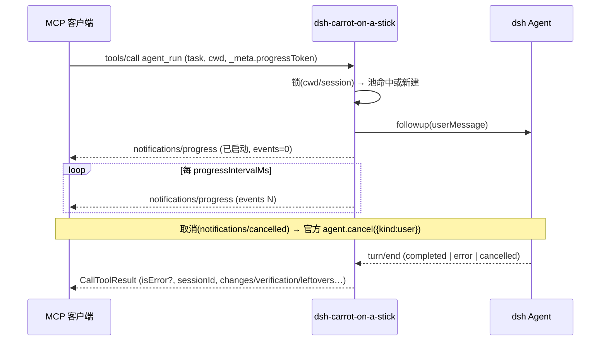

# DSH Carrot on a Stick

> 通过 MCP 操作 [DeepSeek Harness](https://github.com/deepseek-ai/deepseek-harness)（dsh）：在 dsh 进程内启动一个 MCP server，把会话执行、任务队列、工作区管理能力暴露出来，任何 MCP 客户端都能调用。

[](https://www.npmjs.com/package/dsh-carrot-on-a-stick)
[](./LICENSE)

> 📖 [English](./README.md) · 中文（当前页）

## 它解决什么问题

dsh 自带完整的 agent 运行时——模型路由、工具沙箱、预设、会话持久化——但它是一个 Cordis 应用，外部程序无法直接调用。dsh-carrot-on-a-stick 把它「由内向外」翻转：插件在 dsh 进程内启动 MCP server（StreamableHTTP），通过 `ctx.agents` / `ctx.agentPresets` / `ctx.tools` 桥接运行中的 harness。

**你的 MCP 客户端是指挥官，dsh 是执行者。** 适配的客户端包括且不限于：Claude Code、Codex CLI、Cursor、另一个 dsh 实例（经官方 `dsh-mcp-client` 挂接）、任何自动化脚本。

```
MCP 客户端（Claude Code / Codex / 另一个 dsh / …）
   │  agent_run / task_inbox / task_result / model_list / select_model (HTTP + Bearer)
   ▼
dsh-carrot-on-a-stick（MCP server, 127.0.0.1:8090）
   │  ctx.agents.create → 挂载 preset
   ▼
dsh agent —— 完整工具集：bash、fs、todo、web…
```

`agent_run` 生命周期（进度与取消均为规范原生机制）：



## 工具

| 工具 | 用途 |
|---|---|
| `dsh_get_started` | **初次接触 dsh 先调用它**——概念词典、典型工作流与错误→替代路径对照（静态 markdown；initialize 的 server instructions 里也有快速引导） |
| `echo` | 验证 MCP 连通性 |
| `dsh_list_tools` | 列出 dsh 全局工具注册表（name + description；模型工具在 preset 作用域，通常为空） |
| `dsh_status` | 插件部署状态快照：版本/监听/uptime/配置摘要/队列计数/常驻会话数/连接的客户端（与 Web 面板同源数据） |
| `workspace_list` | 列出已注册的工作区（id / 路径 / 归属会话） |
| `model_list` | 列出当前可路由的 provider、模型 id、推理档与缺省选择（选模型前先查这里） |
| `agent_run` | 同步执行任务，返回结构化结果；`sessionId` 续接会话；`provider`/`model`/`reasoningEffort` 指定本次模型；`preset` 为**新建**会话选人格；`detail` 分级控制返回体积；支持 MCP `notifications/cancelled` 取消（走宿主官方 `agent.cancel`）；调用方传 `_meta.progressToken` 时发 `notifications/progress` 心跳 |
| `agent_steer` | 对运行中的 agent 实时干预——`mode=steer`（默认）把转向指令送到当前 turn 的下个 step 边界消化；`mode=inject` 注入模型可见的补充上下文、不唤醒驱动；目标二选一：`sessionId`（常驻池/live）或 `taskId`（执行中的队列任务）；空闲会话拒绝 steer（请改用 `agent_run`） |
| `task_inbox` | 把结构化任务（任务+上下文+cwd+模型+preset）推入异步队列，返回 `taskId` |
| `task_result` | 取回队列任务结果；`detail=status` 轻量轮询，不重复注入 payload |
| `task_list` | 列出队列中的任务（排队/执行中/已结束；队列可观测） |
| `task_cancel` | 取消排队或执行中的任务（执行中走宿主官方 `agent.cancel`） |
| `session_list` | 列出已知会话元数据（live+持久化合并，按创建时间倒序），供挑选续接的 `sessionId` |
| `session_history` | 读 live 会话的对话纪要（user/assistant/tool 轮次，从最新往回取，文本截断） |
| `select_model` | 切换**已存在会话**使用的模型（官方 `sessionController.selectModel` 路径） |
| `attach_session` | 把会话归组到其 cwd 对应的工作区 |
| `rename_session` | 给已有会话改名 |

## 模型选择

优先级：**单次调用参数 > 插件 config（`provider`+`model`） > 宿主默认选择**（`ctx.agentDefaultModel.currentSelection()`，与 Web UI 建会话同源）。只给一边时用低优先级来源补另一边；补齐不了会明确报错，而不是留个空模型（否则 persona 里的 `{{model}}` 变量无值，整个 turn 在组装期失败）。

**推理强度（`reasoningEffort`）与模型同源**：调用参数 > 插件 config > 宿主默认选择里的档位。但若调用方或插件 config 已**显式钉住 provider+model**，就不再继承宿主那个"为别的模型选的"档位（宿主对不支持的显式 effort 直接拒绝，不做 clamp/别名，继承反而会把本来能跑的部署弄挂）。

三条改模型的路径：

| 想要什么 | 怎么做 |
|---|---|
| 这次任务换个模型跑 | `agent_run` / `task_inbox` 带 `provider`+`model`（可加 `reasoningEffort`） |
| 同一个会话中途换模型、保留历史 | `select_model`（官方 `sessionController.selectModel`：校验 + 写一条持久通知，在下一个 step 生效；历史不丢） |
| 整台部署固定用一个模型 | 插件 config 里成对配 `provider`+`model`，并设 `allowModelOverride: false` 锁死调用方覆盖 |

两个来源语义要分清：

- **常驻会话池按 `cwd + 模型三元组 + preset` 分组**。同一目录下用 A 模型跑任务 1、B 模型跑任务 2，是两个独立会话（上下文不串联），这样"哪个会话在用哪个模型"始终可预期；想在一个会话里换模型就用 `select_model`。
- 结果里新增 `model: {provider, model, reasoningEffort?}`（以及可知时的 `preset`），调用方不用猜这次是谁答的。

**per-call preset（人格）**——`agent_run` / `task_inbox` 可传 `preset`（`agentPresets` roster 里的 id），为**新建会话**选人格；池 key 含 preset，同一目录下"干活的 agent"和"审代码的 agent"可以共存。接管已有会话（`sessionId`）沿用该会话创建时的 preset——想换人格就开新会话（与模型同语义）。部署可用 `allowPresetOverride: false` 锁死；未知 preset id 会被拒绝并附可用清单。

`model_list` 的 `source` 说明目录口径：`sessionController` = 官方口径（与 Web UI 模型选择器同一数据源，含 `default` / `routableProviders` / 各 provider 的加载失败与推理档）；`llm` = 回退口径（`llm.listProviders()` + 逐个 `listModels()`，用于没有 `sessionController` 的部署，如 headless，不含推理档元数据）。同时回报插件自身的模型配置与 `allowModelOverride`，调用方一眼能看出"我能不能自己选"。

**结果分级（token 预算）**——本插件的存在意义是省调用方（operator）的上下文：dsh 内部执行细节不进调用方上下文，读回按 `detail` 投影：

- `summary`（默认，~数百 token）：`changes/verification/leftovers` 三行总结 + 回答尾部（总结 JSON 在末尾）+ 工具名列表 + `error`
- `normal`（~2k token）：上述 + 截断的工具调用参数与结果
- `full`（最坏数万 token，排查用）：完整原文
- `task_result` 另有 `status` 档：轮询只返回 `{taskId, status, error?}`，完成后再取一次 summary——避免轮询把结果 payload 重复灌进上下文

续接同一 `sessionId` 时，executor 已记得此前内容，`context` 建议**只发增量**。

每个任务结果都是**结构化**的：`sessionId / model / preset / durationMs / usage? / assistantText / toolCalls / toolResults / changes / verification / leftovers`——调用方可以直接写回自己的记忆系统或工单。`durationMs` 为 turn 墙钟时长；`usage` 在宿主 assistant 事件带 `TokenUsage` 时机会式聚合（没有则省略）。

会话按 `cwd + 模型 + preset` 复用（LRU，默认 8 个），避免每次调用都重新加载项目上下文。

## 典型工作流

**1. 一次性任务（同步）**——直接拿结构化总结：

```json
{ "name": "agent_run", "arguments": { "task": "修复 src/auth 里挂掉的测试", "cwd": "/workspace/app" } }
```

之后用 `"sessionId": "<结果里的 id>"` 续接同一会话——`context` 只发增量。

**2. 异步队列**——提交、轻量轮询、按需取消：

```json
{ "name": "task_inbox", "arguments": { "task": "…", "cwd": "/workspace/app", "provider": "deepseek-official", "model": "…" } }
→ { "taskId": "…" }
{ "name": "task_result", "arguments": { "taskId": "…", "detail": "status" } }   // 轮询: 不重复注入 payload
{ "name": "task_cancel", "arguments": { "taskId": "…" } }                        // 可选
{ "name": "task_result", "arguments": { "taskId": "…" } }                        // 完成后取一次总结
```

`task_list` 一览全部排队/执行中/已结束的任务。

**3. 发现并驾驭会话**——找到对的会话、确认它的模型、回看发生了什么：

```json
{ "name": "session_list", "arguments": { "limit": 10 } }                // sessionId / 标题 / cwd / 模型
{ "name": "session_history", "arguments": { "sessionId": "…" } }        // 最近轮次（截断）
{ "name": "select_model", "arguments": { "sessionId": "…", "provider": "…", "model": "…" } }
```

**4. 长时同步任务**——`agent_run` 原生支持 MCP 进度与取消：客户端传 `_meta.progressToken`
即收到 `notifications/progress` 心跳（`agent running: turn N, last tool X, M new events`），
任意客户端都可用标准 `notifications/cancelled` 取消（两者都接到宿主 agent 的官方 `cancel`），
无需自定义轮询协议。

**5. 实时转向**——让跑偏的 agent 回到正轨，不用取消重跑：

```json
{ "name": "agent_steer", "arguments": { "sessionId": "…", "message": "别重构了, 先把测试修绿" } }
{ "name": "agent_steer", "arguments": { "taskId": "…", "message": "API 变了, 参考 docs/v2.md", "mode": "inject" } }
```

`steer` 在当前 turn 的下个 step 边界被消化（turn 照常结束并回收成完整结构化结果）；`inject`
注入模型可见的上下文、不唤醒驱动。对空闲会话 steer 会被拒绝并提示改用 `agent_run`。

**6. 零 token 浏览**——MCP resources 与只读工具同数据（`dsh://status`、`dsh://queue`、
`dsh://sessions`、`dsh://sessions/{sessionId}/history`）：支持 resources 的客户端用
`resources/list` + `resources/read` 浏览，白名单边界与工具相同。

## 安装与运行

要求 dsh 宿主运行在 **Node.js >= 18**（插件的 `engines` 字段已声明）。

插件以包形式装进 dsh 的 **profile 目录**（loader 从那里解析插件名；在仓库根直接 `--patch` 是找不到本地包的——见 [E2E 记录](./docs/e2e-0.1.5-rc.2.zh.md) 发现 1）：

```bash
git clone https://github.com/Leawind/dsh-carrot-on-a-stick.git
cd dsh-carrot-on-a-stick
npm install && npm run build
npm pack                                        # 产出 dsh-carrot-on-a-stick-<ver>.tgz

dsh plugin --profile web add "<path_to_tgz>" -w

export DEEPSEEK_API_KEY=...                     # 模型凭证(或用 ~/.dsh 里已保存的)
dsh --profile <profile> --patch ./cordis.yml --no-open --port 3081
```

MCP server 监听 `127.0.0.1:8090`（StreamableHTTP）。任意 MCP 客户端指向 `http://127.0.0.1:8090/mcp` 即可。

### 客户端配置示例

通用（任何支持 streamable-http 的 MCP 客户端）：

```json
{
  "mcpServers": {
    "dsh": {
      "url": "http://127.0.0.1:8090/mcp",
      "headers": { "Authorization": "Bearer <your-secret-token>" }
    }
  }
}
```

让**另一个 dsh** 操作这个 dsh（对端 profile 的 `cordis.patch.yml`，走官方 `dsh-mcp-client`）：

```yaml
- id: dsh-carrot-on-a-stick
  name: '@deepseek-ai/dsh-mcp-client'
  config:
    serverName: dsh
    transport: streamable-http
    url: http://127.0.0.1:8090/mcp
    headers:
      Authorization: 'Bearer <your-secret-token>'
```

## cordis.yml（patch 格式）

```yaml
- insert:
    - id: dsh-carrot-on-a-stick
      name: 'dsh-carrot-on-a-stick'
      config:
        http: true
        port: 8090
        host: 127.0.0.1        # 默认仅本机; 暴露前必须加认证
        # authToken: 'your-secret-token'   # Bearer token 认证(常数时间比较)
        # workspaceRoots: ['/workspace']   # cwd 白名单(跨平台分隔符/大小写安全; 同时约束会话面)
        # allowedHosts: ['my-box.lan']     # Host 头白名单追加项(防 DNS rebinding)
        # queuePersistPath: '.dsh/queue.json'  # 队列持久化(重启恢复)
        # queuePersistKey: 'passphrase'    # 持久化文件加密口令(AES-256-GCM; 不设 = 明文 + 启动告警)
        # preset: 'standard'               # 挂载的 agent preset
        # model: ''                        # 空 = 跟随 dsh 用户/默认设置
        # provider: ''                     # 与 model 成对; 空 = 跟随宿主默认
        # reasoningEffort: ''              # 默认推理强度(空 = 适配器默认)
        # allowModelOverride: true         # false = 锁死模型, 拒绝调用方的覆盖
        # allowPresetOverride: true        # false = 锁死 preset, 拒绝调用方的覆盖
        # sessionTtlMs: 86400000           # 空闲 MCP 传输会话超过该时长即被回收(0 = 永不)
```

| 字段 | 默认值 | 含义 |
|---|---|---|
| `host` / `port` | `127.0.0.1` / `8090` | MCP server 监听地址；监听失败（如端口被占）会让插件启动显式失败 |
| `authToken` | — | Bearer token；设置后所有请求强制校验（常数时间比较） |
| `workspaceRoots` | — | cwd 白名单；agent 只能在列出的目录（含子目录）下干活。同时约束**会话面**：按 `sessionId` 的三级接管与 `session_list` / `session_history` 只触达白名单内会话（见「安全」一节） |
| `allowedHosts` | — | Host 头白名单追加项；默认放行绑定地址与 loopback 别名，其余 403 |
| `provider` / `model` | 跟随宿主用户设置（`agentDefaultModel`） | 生成 agent 的模型选择；**需成对配置**，只配一边会用宿主默认补全另一边 |
| `reasoningEffort` | 适配器默认 | 默认推理强度（适配器定义的 id，见 `model_list` 的 `reasoningEfforts`） |
| `allowModelOverride` | `true` | 是否允许调用方（`agent_run`/`task_inbox`/`select_model`）覆盖模型；`false` = 部署锁死，覆盖请求被明确拒绝 |
| `allowPresetOverride` | `true` | 是否允许调用方（`agent_run`/`task_inbox`）为新建会话选 preset；`false` = 部署锁死，覆盖请求被明确拒绝 |
| `preset` | `standard` | 挂载的 agent preset（部署默认/per-call 回退；per-call `preset` 只对新建会话生效——接管已有会话沿用其原 preset） |
| `defaultDetail` | `summary` | `agent_run`/`task_result` 的默认详略级别（单次调用可用 `detail` 覆盖） |
| `reattachOrphans` | `false` | 启动时把未分组会话补挂到工作区（批量写用户数据，默认关；`attach_session` 工具随时可用） |
| `maxQueue` / `taskTtlMs` / `maxAgents` | `100` / 10 分钟 / `8` | 队列容量、结果保留时长、会话池 LRU 上限 |
| `taskTimeoutMs` | `0`（关闭） | agent turn 自动超时；到点走官方 `agent.cancel({kind:'hook'})`，结果 `error` 注明超时。长任务部署请调大或保持关闭 |
| `progressIntervalMs` | `5000`（最小 250） | `agent_run` 的 `notifications/progress` 心跳间隔——仅当调用方传 `_meta.progressToken` 时生效 |
| `queuePersistPath` | —（关闭） | 任务队列持久化文件：每次变化即落盘；重启后 done/error/cancelled 连结果取回、queued 重新执行、running 如实标记 `interrupted by restart` |
| `queuePersistKey` | —（明文 + 启动告警） | 队列持久化文件的加密口令（AES-256-GCM，文件头 `DSHQ1`），防任务载荷明文落盘。错口令/文件损坏按容忍处理（告警，队列从空开始）；旧版明文文件仍可读，下次落盘自动迁移为密文 |
| `sessionTtlMs` | `86400000`（24 小时） | 空闲超过该时长的 MCP 传输会话被服务端回收；客户端对旧会话 id 得到 404，按规范重新 initialize 即可（`0` = 永不回收） |

每个任务结果都是**结构化**的：`sessionId / model / changes / verification / leftovers / error / toolCallCount …`（按 detail 分级投影）；`error` 承接 turn 的非正常收场（模型调用失败/取消/blocked），不会再出现"成功"的空结果；空的 `error`/`taskId` 字段直接省略（不再是空串）。工具级失败（未知 `taskId`、覆盖被拒、服务不可用、cwd 越界、turn 失败）按 MCP 规范以 **`isError: true`** 的工具结果返回——严格客户端与模型无需解析载荷即可识别为失败。`model_list` / `task_list` / `session_list` 另声明 MCP **`outputSchema`**（由 zod 定义派生，tools/list 下发）并返回 `structuredContent`（与 text 镜像同源同值）——强类型客户端免二次解析。

## 零宿主副本

插件运行时对 `@deepseek-ai/*` **零依赖**：所有 dsh 能力都经注入的宿主服务
（`ctx.agents` / `ctx.tools` / `ctx.agentPresets` …）访问；类型只在编译期做声明合并
（`import type`，构建后擦除），`@deepseek-ai/*` 全部是 devDependencies。
因此插件自带的新旧依赖副本永远不会与宿主进程内的私有 Symbol/类标识错位——
上游 0.1.x 时代 `scopeOf` 副本不匹配导致 agent 静默失去全部工具的根因就此消除。
事件读取走公开 API `session.snapshotEvents()`，消息构造用与宿主 `createUserMessage`
逐字段一致的本地实现。

## 安全

⚠️ 这个插件暴露的是**本机执行能力**（等价于远程代码执行）。默认只监听 `127.0.0.1`。启用时务必：

1. 配置 `authToken`——防本机其他进程与 DNS rebinding 攻击（常数时间比较）；
2. 配置 `workspaceRoots`——限定 agent 可操作的目录；
3. 不要绑定 `0.0.0.0` 或暴露到局域网/公网，除非前面有反代 + TLS + 认证。

内置防护：Host 头白名单（默认绑定地址 + loopback 别名，防 DNS rebinding，缺失 Host 400）；
同一白名单上的 Origin 头校验（带跨域或非法 `Origin`——如 `Origin: null`——一律 403；不发 Origin
的非浏览器 MCP 客户端不受影响）；HTTP 入口只服务 `/mcp`，其余路径 404；401 响应带
`WWW-Authenticate: Bearer` 挑战；空闲传输会话超过 `sessionTtlMs`（默认 24 小时）自动回收。
工具同时携带协议元数据（`title`、`annotations.readOnlyHint` 等，2025-06-18 协议字段），
便于客户端标注与沙箱判断。

**`workspaceRoots` 的边界在「执行与内容读取」**：cwd 参数（`agent_run` / `task_inbox`，提交时校验）、
按 `sessionId` 的三级接管（常驻池 / live / 持久化 resume，逐层校验会话自身 cwd）、实时干预
（`agent_steer` 拒绝越界会话）、以及读取面——工具（`session_list` 只列白名单内会话，`cwd` 参数
越界直接拒绝；`session_history` 越界会话不可读）与 MCP resources（`dsh://sessions` /
`dsh://sessions/{id}/history` 与工具共用实现、同一边界）。
`select_model` / `rename_session` / `attach_session` 等元数据操作仍按 `sessionId` 可达
（不触达执行与内容）。白名单未配置时以上行为全部不生效。

**spawn 会话的工具审批**：spawn 出的会话里，工具调用走宿主 / preset 的 approval 策略——本插件
经 MCP 驱动时**无人在环**，`ask` 类策略下敏感操作可能弹窗等待或 fail-closed。部署前请按实际
preset 验证敏感操作的行为，或选用无人值守友好的 preset/策略。

注意：`queuePersistPath` 会把任务载荷（任务文本、调用方上下文、结果）写入指定文件——默认明文
（启动时告警），配置 `queuePersistKey` 后为 AES-256-GCM 密文；无论哪种都请放在文件系统权限
合适的路径。

## Web 设置面板

bundle 还会向 dsh Web UI 注入一个设置区（**设置 → dsh-carrot-on-a-stick**）：

- 实时状态徽章（监听中 / 已软停 / http 关闭）与运行时长；
- MCP 端点（点击复制）与**停止 / 启动**按钮——软停止会排空并干净关闭，启动重新监听
  （重启后的真实握手有测试覆盖）；
- 已连接的 MCP 客户端：会话 id、User-Agent、连接时间、最近活跃、请求数；
- 模型 / preset / 认证 / 会话 TTL / 队列持久化摘要，以及队列计数（活跃 / 完成 / 失败 / 取消）。

面板经同源路由 `/_dsh/dsh-carrot-on-a-stick/*` 与宿主通信；变更类路由要求同源标识，无需额外端口或
CORS 暴露。

## 源码来源

本项目的初始源码**复制自** [`chushixixin/dsh-harness-mcp-server`](https://github.com/chushixixin/dsh-harness-mcp-server)（MIT，感谢 @chushixixin），随后作为独立项目演进：不保留 git fork 关系，也不计划向上游贡献。主要改造方向：

- **去 Hermes 化**：面向任意 MCP 客户端（Claude Code / Codex / Cursor / 另一个 dsh / 自动化脚本）；
- **贴合当前版本 dsh**：见下方 Roadmap；
- **独立命名与仓库**：`dsh-carrot-on-a-stick`。

## Roadmap / 已知限制（对 dsh 0.1.5-rc.2）

0.2.0 Roadmap 的兼容性问题已在 0.3.0 处理；**0.3.1 完成真机 E2E 验证**（全绿，见 [docs/e2e-0.1.5-rc.2.zh.md](./docs/e2e-0.1.5-rc.2.zh.md)），并修复 E2E 发现的问题：`{{model}}` 提示词变量（模型选择现经 `agentDefaultModel` 补全）、turn 失败透出、池会话 flush、存量捞回默认关闭、安装流程文档修正。
**0.5.0 补齐模型选择面**：`model_list`（官方目录 / `llm` 回退）、`agent_run`+`task_inbox` 的按调用覆盖、`select_model`（会话内换模型）、`reasoningEffort`、`allowModelOverride` 门禁、结果自报 `model`、会话池按 `cwd + 模型` 分组。
**最新批次（未发布）**：`agent_steer`（对运行中 agent 实时转向/注入，按 `sessionId` 或执行中的 `taskId`；空闲会话拒绝 steer）、per-call `preset`（池按 `cwd + 模型 + preset` 分组、`allowPresetOverride` 门禁）、进度心跳增强（turn 轮数 + 最近工具）与结果增强（`durationMs`、机会式 `usage`）、`dsh_status` + `workspace_list` 工具、MCP resources 面（`dsh://status`、`dsh://queue`、`dsh://sessions`、逐会话 history，与工具同白名单边界）。详见 CHANGELOG（批次 18）。
**上一批次（未发布）覆盖六个方向**，逐批细节见 CHANGELOG：

- **协议一致性**：工具错误结果带 `isError: true`、DNS rebinding 防护补上 Origin 头校验、401 带 `WWW-Authenticate` 挑战、工具暴露 `title` + `annotations`、空闲传输会话自动回收（`sessionTtlMs`）、10MB 请求体上限；
- **取消**：`agent_run` 支持 MCP `notifications/cancelled` 与客户端超时（都接到宿主官方 `agent.cancel`）；
- **可观测**：`notifications/progress` 进度心跳（规范 `_meta.progressToken`）、`task_list`、只读 `session_list`（含当前模型）与 `session_history`（可翻页）；
- **异步队列**：`task_cancel`、可选持久化（`queuePersistPath`，原子写）、`running`/`interrupted` 状态如实上报；
- **韧性**：锁表清理、LRU 淘汰跳过活跃会话、损坏持久化文件启动存活；
- 协议审查报告见 [docs/protocol-audit-2026-09-24.zh.md](./docs/protocol-audit-2026-09-24.zh.md)。

仍然存在的限制：

- [x] ~~任务队列在进程内存中，进程重启丢失~~——可选持久化（`queuePersistPath`）已加；不配置时仍是内存队列。
- [x] ~~无服务端自动超时~~——可选的 `taskTimeoutMs`（默认关闭）已加；调用方仍可主动取消（`agent_run` 用 MCP `notifications/cancelled`，队列任务用 `task_cancel`）。
- [x] ~~队列不能列举/取消~~——已补（`task_list` / `task_cancel`）。
- [x] ~~只读查询面不完整：没有 `session_list`~~——已补（列会话元数据 + `session_history` 纪要；仅持久化的会话读整日志仍需宿主侧 API）。
- [x] ~~`preset` 仍是部署级配置（一个 MCP server 实例一种 persona），不能按调用指定~~——`agent_run` / `task_inbox` 支持 per-call `preset`（对新建会话生效；池按 `cwd + 模型 + preset` 分组，`allowPresetOverride` 门禁）；接管已有会话沿用其原 preset。
- [ ] spawn 出的会话里工具调用走宿主 approval 策略（`ask` 下敏感操作可能弹窗或 fail-closed；本次 E2E 的只读操作未受影响）。边界已在「安全」一节文档化，真机行为验证依赖 E2E。
- [ ] `dsh_list_tools` 只列宿主全局注册表；按 agent 作用域列出实际可用工具需要宿主侧 API（ScopeKey 私有符号，零副本原则下拿不到）。工具已把该盲区的自述随返回数据一起给出（`note` 字段）。
- [ ] `select_model` 依赖 web profile 的 `sessionController`；该服务缺席时（如 headless）只有目录回退与按调用覆盖可用，工具会明确报不可用。
- [ ] 协议原生 task augmentation（2025-11-25 草案，SDK 接口标注 experimental）：把 `agent_run` 暴露为规范原生任务，走 `tasks/get` / `tasks/result` 轮询。有意缓做——`task_inbox` / `task_result` / `task_cancel` 已对所有客户端覆盖同一工作流，等规范离开草案再评估。
- [ ] dsh 未来版本升级时，devDeps 里的 `@deepseek-ai/*` 类型版本需同步（仅影响编译期，运行时零依赖不受影响）。

## 开发

```bash
npm install
npm run build    # 独立构建(纯 tsc), 产出 lib/
npm run typecheck  # 测试 TS 文件类型检查(不产出)
npm run smoke    # 端口 8099/8098/8096/8095/8094/8093/8092/8091/8089/8088/8087/8086/8085/8083/8082 假 ctx 冒烟(190 项, 真实 MCP 协议往返 + 官方 SDK Client 对接; 假宿主桩在 smoke-harness.ts) + 端口冲突专项
```

测试是普通 TypeScript，直接 `node smoke.ts` 运行（Node 原生 type stripping）——仅开发脚本要求 Node ≥ 23.6；发布的插件本体仍支持 Node ≥ 18。

源码按职责分模块(config/state/paths/persist/projection/host/engine/tools/onboarding,`index.ts` 只做装配),
模块地图与设计约束见 [docs/architecture.zh.md](./docs/architecture.zh.md)。

真机 E2E（需要本机 dsh 与模型凭证，会花少量 token）：按 [docs/e2e-0.1.5-rc.2.zh.md](./docs/e2e-0.1.5-rc.2.zh.md) 的方式起一个独立 profile，然后 `E2E_WITH_AGENT=1 node e2e.ts`。

## License

MIT —— 见 [LICENSE](./LICENSE)（保留上游版权声明）。
